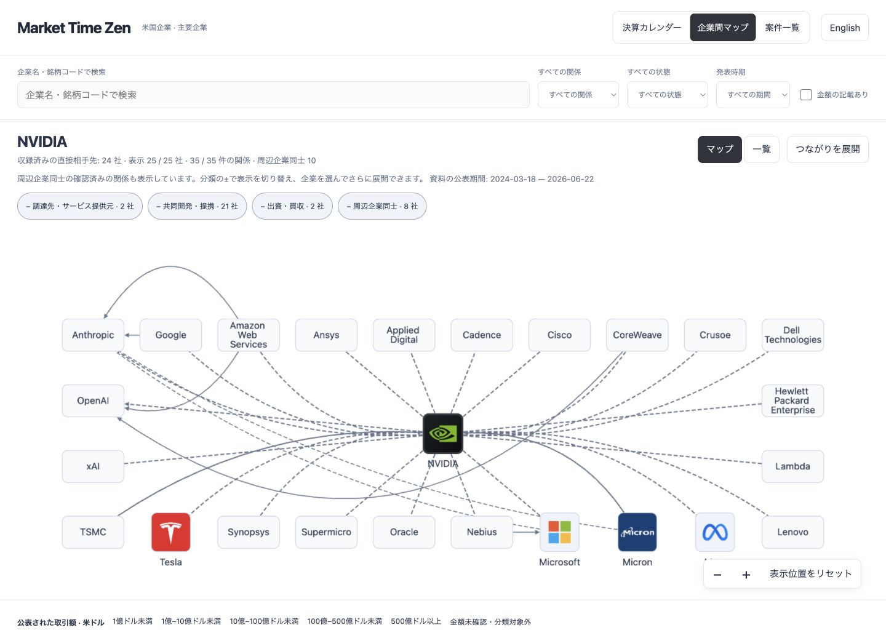
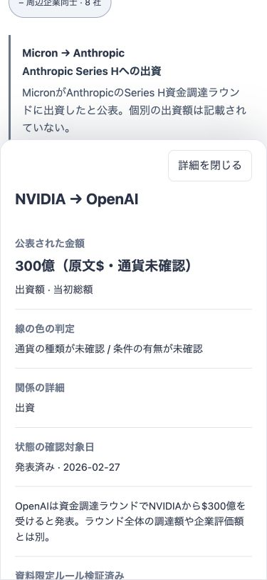

# 周辺接続・金額判定・SEC収集（2026-09-26）

この文書は前回時点の記録です。最新は[94候補の精査・SEC補完報告](relationships-review-2026-09-26.md)を参照してください。
ローカル表示を更新済み。本番デプロイ、commit/push、Actionsの有効化、GitHub Secret・Pages設定の変更は行っていません。公開用buildは `4ece568437d651b7f8a2feca`、63社・77関係・金額付き12案件・根拠資料29件です。前回52社・68関係から、SEC識別情報の照合と公式発表4件による9関係の追加を行いました。全主要企業の関係網羅や100倍化は未達です。

## 周辺企業同士の接続

会社別JSONに、直接の相手先同士を結ぶ確認済み関係 `peer_relationships` を追加しました。中心企業を選んだ直後から読み込み、表示中の両端企業を結びます。共通の取引先がいるという理由だけで新しい線は生成しません。直接関係と周辺同士の関係の件数は分離し、同じ関係IDの重複表示を防ぎます。

| 中心企業 | 直接相手先 | 直接の関係 | 初期表示に加わる周辺同士の関係 |
|---|---:|---:|---:|
| NVIDIA | 24社 | 25件 | 10件 |
| Apple | 15社 | 15件 | 2件 |
| Google | 8社 | 8件 | 2件 |
| Microsoft | 4社 | 6件 | 3件 |
| AMD | 3社 | 3件 | 0件 |
| Meta | 7社 | 7件 | 0件 |

「周辺企業同士」の±で表示を切り替えられます。展開済みの企業名ボタン列は、マップの表示領域を圧迫するため削除しました。企業単位の展開取消は、その企業の詳細にある「この企業の展開を戻す」で行います。表示0件の企業には、現在の承認済みデータにその条件に合う線がないという意味です。実世界に関係がないと断定するものではありません。展開・縮小時にも残った近傍データから共有の線を再構成します。初期30社／展開後150社の上限は維持し、直接相手先を優先して表示します。資料の期間は表示中の周辺関係も含みます。

密集部分で件数ラベルが重ならないよう、線のラベルは選択・ホバー時に表示します。複数の関係をまとめた線を開くと各関係の詳細へ進めます。



## 灰色の理由

金額の記載と、色分けに使える総額は異なります。`tier_reasons` を生成側で付与し、一覧・関係詳細・凡例に説明を追加しました。内部の段階番号は表示しません。

| 公開中77関係の内訳 | 件数 |
|---|---:|
| 金額データなし | 65 |
| 金額はあるが現在の色分け条件に該当しない | 11 |
| 確認済みの単独USD総額として色分け可能 | 1 |

金額データなし65件のうち62件は採用資料に記載なし、3件は確認待ちです。「非公表と明記」とは区別します。色分け対象外の理由には通貨未確認、上限・下限、条件付き、条件の有無が未確認、追加額・年額、対象範囲が異なる複数金額があります。複数関係を束ねた線も金額を合算せず灰色で表示します。**灰色だから小さな取引、という意味ではありません。**

確認中、以前のAWS–Pinterest、AWS–Anthropic、Amazon–Anthropicの記録に、`$`だけでUSDと判定していた箇所を発見。4つの金額を通貨未確認へ修正し、USDには明示された通貨根拠を必要とする検証を追加しました。Amazon–Anthropicの将来追加出資$200億も、原文の `up to` に合わせ、確定値ではなく条件付き上限として修正しました。現在の色分け可能な1件はIBM–Red Hatの買収総額です。件数や色を増やすために通貨・条件を推測していません。



## 追加した一次資料

- [GoogleによるWiz買収完了](https://blog.google/innovation-and-ai/infrastructure-and-cloud/google-cloud/wiz-acquisition/)：買収完了、GoogleのAlphabetグループ所属を個別に記録。完了発表に書かれていない買収額は別記事から無条件に移していません。
- [Google Cloud Next 2024](https://blog.google/innovation-and-ai/infrastructure-and-cloud/google-cloud/google-cloud-next-2024-generative-ai-gemini/)：Anthropic、AI21 Labs、Contextual AI、Essential AI、Mistral AIによるAI基盤利用。個社の製品構成・利用金額は推測しません。
- [AMDによるZT Systems買収完了](https://newsroom.amd.com/news/amd-completes-acquisition-of-zt-systems/)：AIシステム設計・導入技術を含む買収。
- [Red HatとAMDの協業](https://newsroom.amd.com/news/red-hat-and-amd-strengthen-strategic-collaboration/)：OpenShift AIのInstinct対応とAI推論検証。

取得した原文と段落のhash、当事者、製品、状態、短い引用を固定して評価しました。過去資料の追加は新規契約発生と区別します。MicrosoftのNuance買収完了ページは取得器で本文を取得できず、今回追加していません。

## SECの実接続と候補収集

ユーザー指定の運用連絡先を `.cache/relationships/sec-contact.env` に保存（権限600、git除外、配信対象外）。`large_cap_focus` 15社すべてのCIK・銘柄をSEC submissionsで照合しました。企業名・上場情報の根拠は `relationships_data/state/sec_identities.json` に保存。SECで識別情報を補完しても、既存の社名に基づく関係検証を壊さないようにしました。

実収集で、対象外のForm 4のXSL付きパスが後続の8-K等の収集を止める不具合を発見し修正。対象外の形式を先に除外し、その件数を記録します。`collect --sec-only` を追加し、IRを待たずSECだけ収集できます。

直近3か月のバックフィル実行は原文40件を試行し、39件成功。1件は10MBの上限超過で保留しました。取得上限があるため、これは全履歴の収集完了ではありません。2社の関係候補は75→94件、段落調査キューは300件、上限を超えた1,085段落は繰越です。これらは実在する取引として未検証で、公開77関係には混ぜていません。

```bash
source .cache/relationships/sec-contact.env
.venv/bin/python -m relationships_py collect --sec-only --mode incremental --universe large_cap_focus
.venv/bin/python -m relationships_py extract
.venv/bin/python -m relationships_py review-report
```

候補と原文の確認後に承認・ルール評価を行い、`export` → `validate-public` → `scripts/stage-site.py` でローカル公開用データを生成します。ローカルHTTPサーバーの配信元は `.site-build` に限定します。上記手順は本番デプロイを行いません。

## 実施済みの確認と残作業

テスト停止の指示前に、既存カレンダーunittest35件、関係処理pytest95件、JavaScript25件が成功しました。ブラウザーではNVDAの周辺10関係の初期表示、±で10→0→10の切替、一覧・金額判定理由、375px幅で横方向にはみ出さない詳細を確認済みです。その後はユーザー指示に従って追加テストを停止しました。iOS実機は未確認です。

- GitHub Actionsの `SEC_USER_AGENT` Secret設定・実ランナーでの定期収集は未実施。収集・Pagesの有効化やデプロイは行っていません。
- 現在の運用連絡先はローカルのみ。`.cache`を削除した場合は再設定が必要です。
- 契約金額が別資料にのみ記載される場合の突合、通貨根拠、契約の変更・履行・終了の追跡、候補審査を継続する必要があります。
- 候補の大量自動承認、全銘柄の網羅、時価総額順位の自動更新、PDF/OCR対応は実装済みとは扱いません。
